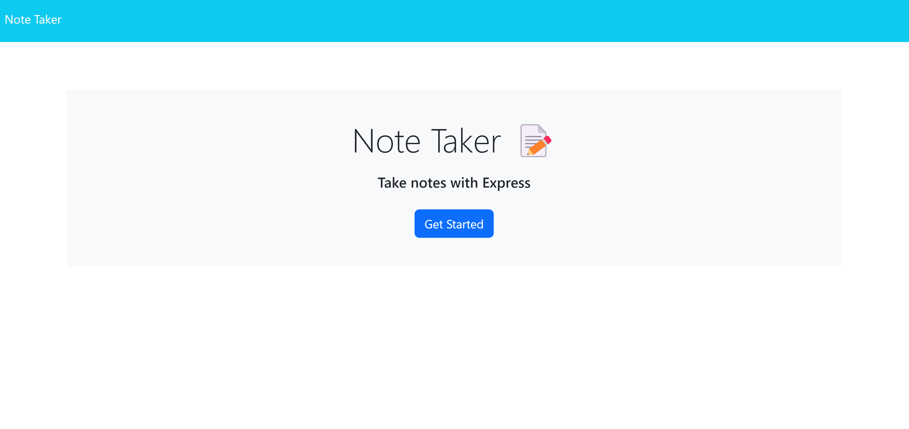
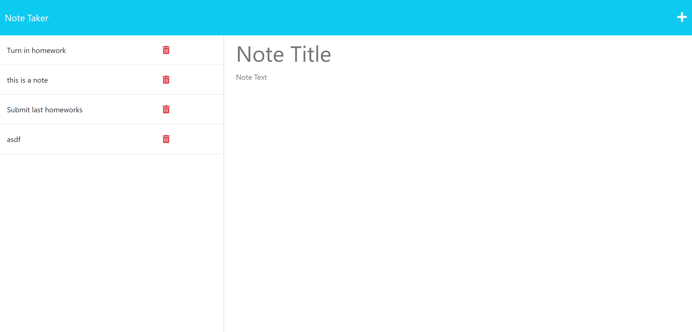
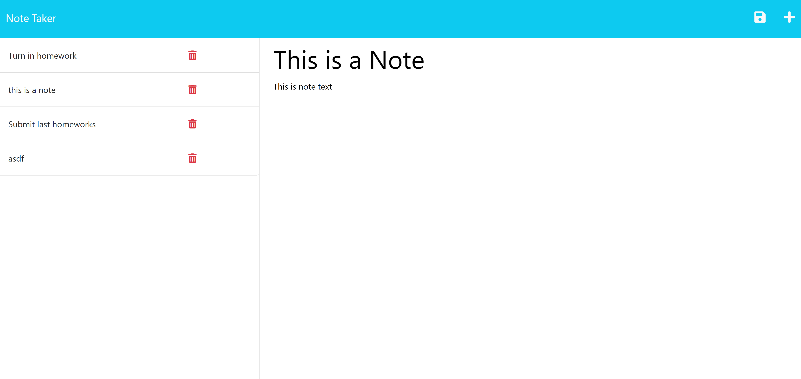
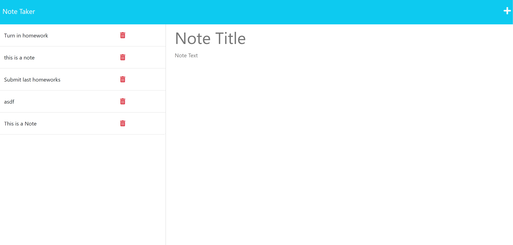

# ToDoLister

## Description:
This project is a Note Taker application, the code was generated by myself with the assistance of the GWU coding Boot camp tutoring program. Using this will allow a user to load into an interactive page which will allow for the creation and saving of new notes which will be saved in local storage to be viewed at a later time.

## Installation:
This application requires no additional softeware or programs to be installed. Access to a working internet browser and the URL are the only requirements to access this tool

## Usage: 
### The user will open the site and be greeted with this homescreen

### The user will then click the "get started" and be shown a page where they can input notes

### The user will then be able to type a note by clicking the "+" sign in the top corner,

### After typing the note the user will click the save icon which will appear in the top right corner and the new data will be uploaded and saved,

MIT License

### A working link to the application is:
https://todolister-2aad6cf7c4bc.herokuapp.com/
